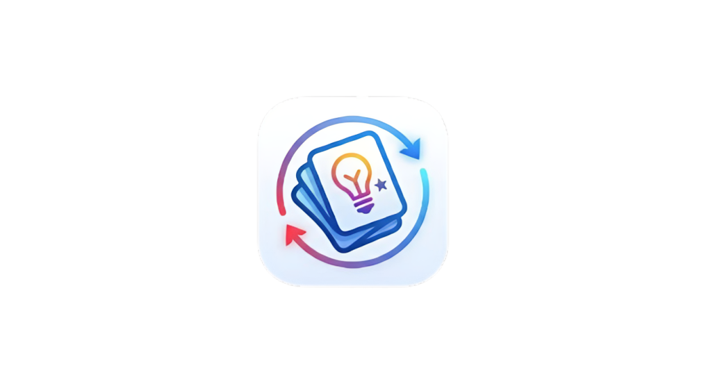
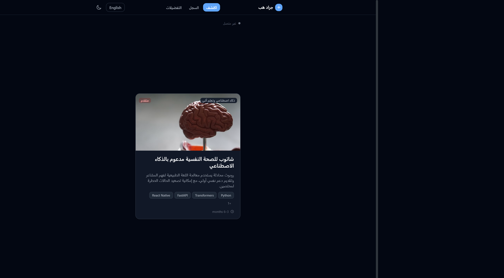
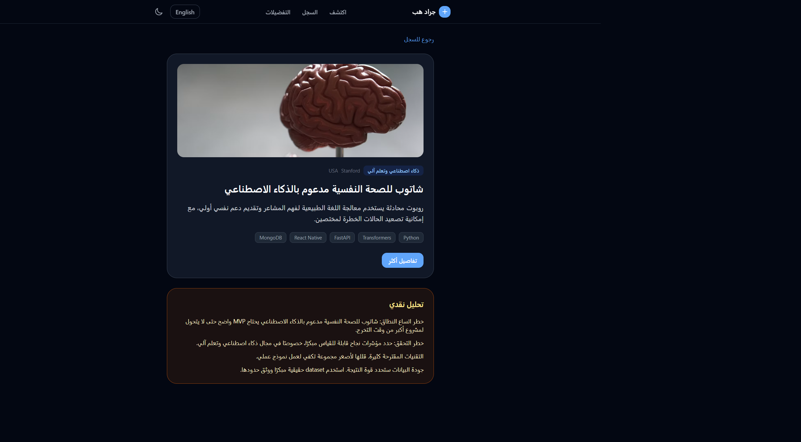
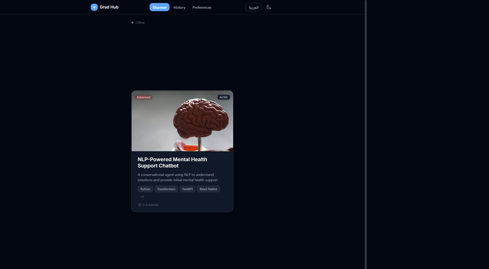
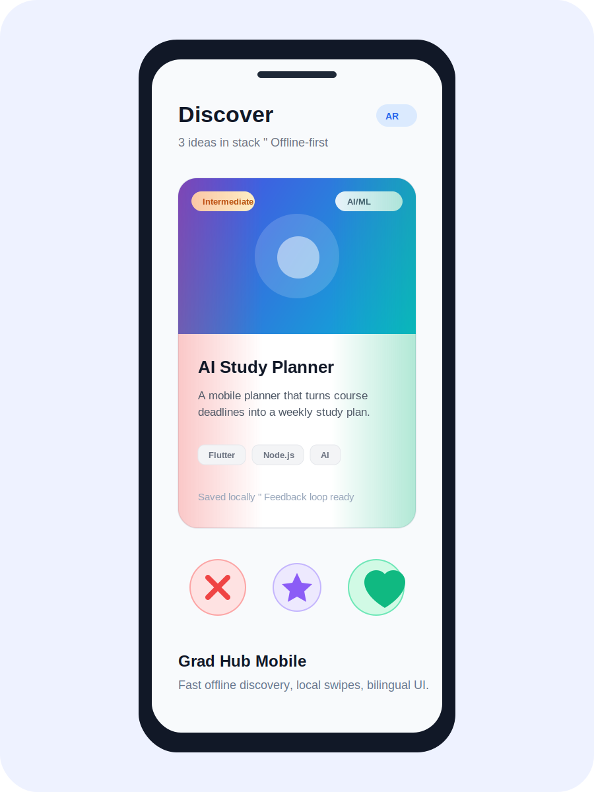

# Grad Hub — Graduation Project Discovery

<p align="center">
  
</p>


**Grad Hub** is a bilingual graduation-project discovery platform. It helps students find stronger project ideas, save what they like, reject what does not fit, and gradually build a preference profile that improves recommendations.

**جراد هب** منصة عربية/إنجليزية لاكتشاف أفكار مشاريع التخرج. تساعد الطالب يلاقي أفكار مناسبة، يحفظ الأفكار المهمة، يستبعد التصنيفات غير المناسبة، ويكوّن تفضيلات ذكية تتحسن مع كل Swipe.

## What Makes It Different

### English

- **Swipe-based discovery:** Browse curated graduation project ideas using familiar left, right, and star actions.
- **Offline-first mobile app:** The Flutter app can show ideas, store swipes, save history, and update preferences locally without waiting for a laptop backend.
- **Smart preference loop:** Likes, dislikes, stars, and category choices update the recommendation profile.
- **Category control:** Drag categories into `Liked`, `Disliked`, or `Available` groups on web and mobile.
- **Bilingual experience:** Arabic RTL and English LTR interfaces are supported across the product.
- **Rich idea cards:** Each idea includes category, difficulty, tech stack, image, description, and source link.
- **History and filtering:** Review starred, liked, and disliked ideas separately.

### العربية

- **تصفح بالسحب:** اكتشف أفكار مشاريع التخرج بسحب يمين/شمال أو نجمة للاهتمام العالي.
- **موبايل يعمل بدون لابتوب:** نسخة Flutter تعرض الأفكار وتحفظ السوايب والهيستوري والتفضيلات محليًا بدون انتظار Backend.
- **Feedback loop ذكي:** كل إعجاب أو رفض أو نجمة يغير التفضيلات ويحسن الترشيحات.
- **تحكم في التصنيفات:** اسحب التصنيفات إلى `Liked` أو `Disliked` أو `Available` في الويب والموبايل.
- **واجهة عربية وإنجليزية:** دعم RTL للعربية وLTR للإنجليزية.
- **كروت أفكار غنية:** صورة، وصف، صعوبة، تصنيف، تقنيات، ورابط مصدر لكل فكرة.
- **سجل منظم:** فلترة الأفكار حسب starred وliked وdisliked.

## Screenshots

### Web — Arabic Discover



### Web — Idea Details + Source Link



### Web — English Discover



### Mobile — Offline Discover



## APK Download

The latest Android APK is published through GitHub Releases when available:

[Download the latest APK](https://github.com/Samer-Elhamy/grad-hub/releases)

For local builds:

```powershell
cd mobile
flutter build apk --release
```

The generated APK is located at:

```text
mobile/build/app/outputs/flutter-apk/app-release.apk
```

## Product Surfaces

- `web/` — React/Vite app with swipe discovery, history, preferences, category drag/drop, and bilingual UI.
- `mobile/` — Flutter app with offline-first ideas, local swipe history, local preferences, and bilingual UI.
- `backend/` — Express/TypeScript API for web development mode and future hosted sync.
- `site/` — Static prototype/reference surface.

## Tech Stack

| Layer | Stack |
| --- | --- |
| Web app | React, Vite, TypeScript, Zustand, Tailwind CSS, Framer Motion |
| Mobile app | Flutter, Riverpod, GoRouter, SharedPreferences |
| Backend | Express, TypeScript, Zod, WebSocket |
| Static prototype | HTML, CSS, JavaScript |
| Testing | Vitest, Testing Library, Flutter Test, Jest, Supertest |

## Repository Structure

```text
grad-hub/
├── backend/              # Express API, preferences, swipe history, idea routes
├── web/                  # Main React/Vite product UI
├── mobile/               # Flutter Android app with local-first behavior
├── site/                 # Legacy static Arabic-first prototype
├── docs/
│   ├── assets/           # Social preview and screenshots
│   └── design-tokens.md  # UI token notes
├── tests/                # Cross-surface smoke/e2e tests
└── scripts/              # Local validation scripts
```

## Run Locally

### Backend

```powershell
cd backend
npm install
npm run dev
```

The API runs on [http://localhost:3000](http://localhost:3000).

### Web App

```powershell
cd web
npm install
npm run dev
```

The web app runs on [http://localhost:5173](http://localhost:5173).

### Mobile App

```powershell
cd mobile
flutter pub get
flutter test
flutter build apk --release
```

## Useful API Endpoints

| Endpoint | Purpose |
| --- | --- |
| `GET /api/ideas/next` | Returns the next recommended idea |
| `GET /api/ideas/:id` | Returns a detailed idea |
| `POST /api/swipe` | Records `left`, `right`, or `up` swipe |
| `GET /api/preferences` | Reads learned preferences |
| `POST /api/preferences` | Updates preferences |
| `GET /api/history?filter=starred` | Reads starred ideas |
| `GET /api/history?filter=liked` | Reads heart-liked ideas |
| `GET /api/history?filter=disliked` | Reads disliked ideas |

## Verification

Recommended checks before release:

```powershell
cd web
npx vitest run
npm run build
```

```powershell
cd mobile
flutter analyze lib test
flutter test
flutter build apk --release
```

> Note: `backend npm run typecheck` currently exposes pre-existing type issues in older search/provider modules unrelated to the main Grad Hub flow.

## Roadmap

- Add a hosted sync service for optional multi-device mobile sync.
- Expand the offline idea catalog and add import tools for new project datasets.
- Add authenticated multi-user profiles.
- Add AI-generated critique and feasibility scoring per student context.
- Add shareable project shortlists.
- Publish a hosted demo.

## License

Personal/student project. Add a formal license before commercial reuse.
